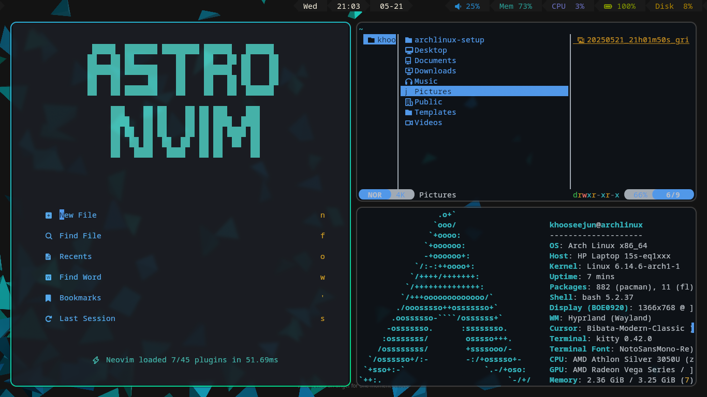

### My Arch Linux Setup
##### Window Manager
hyprland [Hyprland](https://hyprland.org/) 
Theme: default

##### Terminal Emulator
kitty [Kitty](https://sw.kovidgoyal.net/kitty/)
Theme: (Github Dark from kitten theme)

##### App Launcher
rofi [Rofi](https://github.com/davatorium/rofi) 
Theme: (Arc-Dark from rofi-theme-selector)

##### Text editor
neovim [NeoVim](https://neovim.io/) 
Theme: [AstraNVim](https://github.com/AstroNvim/AstroNvim)

##### Status Bar
waybar [Waybar](https://github.com/Alexays/Waybar) 
Theme: [cjbassi](https://github.com/cjbassi/config/tree/master/.config/waybar)

##### File Manager
yazi [Yazi](https://github.com/sxyazi/yazi)

##### System Info
fastfetch [Fastfetch](https://github.com/fastfetch-cli/fastfetch)

##### Font
noto-fonts noto-fonts-cjk

##### Icon
papirus-icon-theme [Papirus icon Theme](https://github.com/PapirusDevelopmentTeam/papirus-icon-theme)

##### Cursor
bibata-cursor-theme [Bibata Cursor](https://github.com/ful1e5/Bibata_Cursor)

#### Requirement
git
yay
